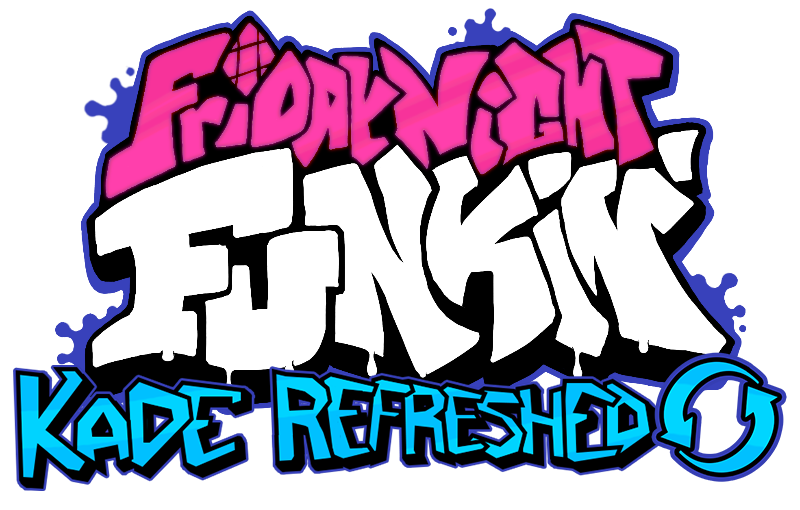

# Friday Night Funkin' - Kade Refreshed

Kade Refreshed is a heavily modified version of [Kade Engine](https://github.com/KadeDev/Kade-Engine) made to be easy to mod!

Modding Features Include:
- Easy to add weeks and songs
- Softcoded stages and chars
- Softcoded note styles and types
- Object Oriented Lua
- HScript support using [HScript-Improved](https://github.com/FNF-CNE-Devs/hscript-improved)
- Remade Chart Editor
- New Asset Handler that uses the file system.